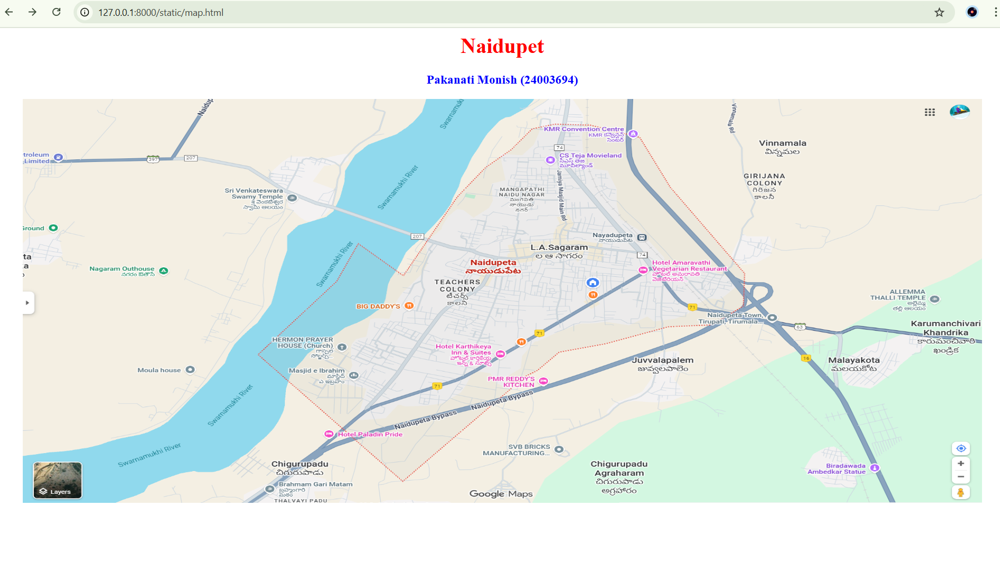
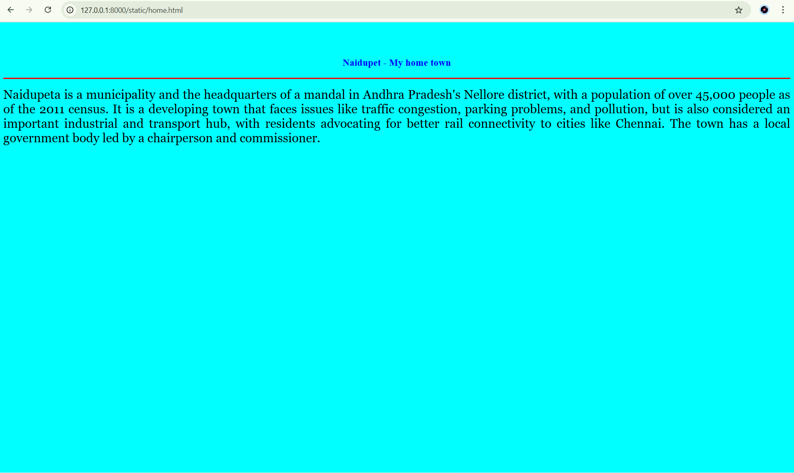

# Ex04 Places Around Me
## Date:03/11/2025 

## AIM
To develop a website to display details about the places around my house.

## DESIGN STEPS

### STEP 1
Create a Django admin interface.

### STEP 2
Download your city map from Google.

### STEP 3
Using ```<map>``` tag name the map.

### STEP 4
Create clickable regions in the image using ```<area>``` tag.

### STEP 5
Write HTML programs for all the regions identified.

### STEP 6
Execute the programs and publish them.

## CODE
```
map.html 

<html>
<head>
<title>My City</title>
</head>
<body>
<h1 align="center">
<font color="red"><b>Naidupet</b></font>
</h1>
<h3 align="center">
<font color="blue"><b>Pakanati Monish (24003694)</b></font>
</h3>
<center>

<map name="MyCity">
<area shape="rect" coords="100,100,900,900" href="home.html" title="My Home Town">
<area shape="circle" coords="100,130,45,50" href="teachers.html" title="teachers colony">
<area shape="circle" coords="140,200,30,60" href="juvvalapalem.html" title="juvvalapalem">
</map>
</center>
</body>
</html>

```

## OUTPUT





## RESULT
The program for implementing image maps using HTML is executed successfully.
